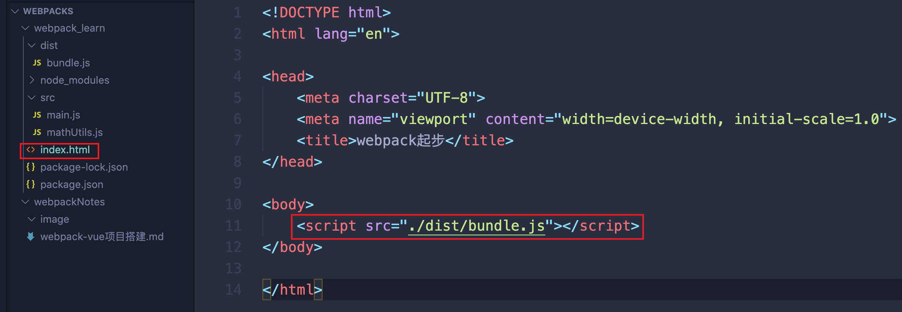
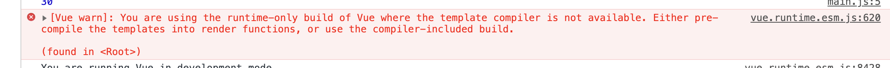
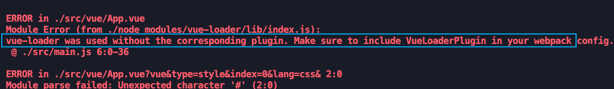

# 1. webpack

```js
1. 安装webpack之前先安装node，因为webpack依赖node环境；node环境所需要的依赖包需要包管理工具npm进行引入；安装node时会自动帮我们安装npm包管理工具
2. 安装webpack：

	// 备注在安装webpack之前先使用npm init初始化下项目，这时候项目中就有package.json了,package.json是node的包管理的文件，如果当前项目需要单独用到node相关的包则需要有package.json;这样当别人获取到项目时可以通过npm install下载package.json中的包
	npm init
  // 如果不指定版本则默认安装最新的webpack
	npm install webpack@3.6.0 (指定版本)
	// 当我们使用的时webpack4+时，则也需要安装webpack-cli，因为webpack的命令放在了webpack-cli中
	npm install webpack-cli
	// 显示版本号，说明webpack安装成功
	webpack -v	
```
```js
// --save-dev是局部安装依赖，是开发时依赖，也就是说只有打包编译时需要使用，包发到服务器之后就不需要依赖了，包发到服务器之后需要的是运行时依赖
npm install webpack --save-dev

1. 怎么查看开发时依赖和运行时依赖（package.json）
	- devDependencies：配置的是开发时依赖
	- dependencies：配置的是运行时依赖
```


## 1.1 什么是webpack

- 模块打包工具（处理模块依赖关系生成模块关系网）

## 1.2 webpack的起步
> CMD AMD ES6模块化都支持
- 打包后的bundle引入到index.html中进行展示
```js
// src/mathUtils.js：commonJS的导入导出webpack也支持
function add (a, b) {
    return a + b;
}
module.exports = {
    add
}

// src/main.js：使用commonJS的方式依赖导入mathUtils.js
const { add } = require('./mathUtils.js')
console.log(add(10, 20))
```
```js
// 命令行手动打包编译main.js输出到dist/bundle.js：如果在webpack.config.js配置过mode开发模式这里就不需要加 --mode development
webpack ./src/main.js -o ./dist/bundle.js --mode development
```


# 2. webpack配置
## 2.1 webpack.config.js
- 新建webpack.config.js对webpack进行配置
### 2.1.1 webpack命令映射
- 命令映射好处：
  1. 是如果命令太长是可以采用这种配置
  2. 只要在终端运行的命令都是全局的命令；但是script脚本中配置的命令是会优先在本地找(node/moudles)，如果没有找到才会使用全局的
- 如果不配置script怎么使用局部本地命令？
  - 需要在本地的node/moudles/ 下查找可执行的二进制命令，然后手动执行`./node_modules/webpack xxxxx`
```js
// 未映射之前使用的是：
webpack ./src/main.js -o ./dist/bundle.js

// 映射解析：映射webpack命令到package.json的script脚本中； npm run buil == webpack命令；
"scripts": {
    "build": "webpack"
},
npm run build ./src/main.js -o ./dist/bundle.js
// 将编译文件和打包输出文件配置到输入输出中，后面直接使用 `npm run build`
npm run build
```
## 2.2 webpack的导入导出配置
- ***导入导出基本使用***
```js
// webpack.config.js配置导入导出
const path = require('path')
module.exports = {
    entry: './src/main.js',
    output: {
        path: path.resolve(__dirname, 'dist'),
        filename: 'bundle.js'
    }
}
// npm run build直接运行
```
- ***多入口出口配置省略***

## 2.3 loader
+ ***背景***：webpack会自动处理js之间的相关依赖，但是在开发中我们除了基本的js，也需要加载css、图片、还包括高级的es6搭配es5的转换、typescript转es5、scss和less转成css、将.jsx和.vue转.js文件等。对webpack本身来说，是不支持这些转换的。由此给webpack扩展loader就可以解决了
+ ***使用步骤***：先安装再在webpack.config.js中配置就可以
### 2.3.1 css-loader&less-loader
```js
1. 安装(开发时依赖)：
npm install --save-dev css-loader
npm install --save-dev style-loader
2. 配置：
module: {
	rules: [
		{
			test: /\.css$/,
			use: ['style-loader', 'css-loader']
		}
	]
}
3. 解析
style-loader： 负责将样式添加到DOM中
css-loader： 解析CSS文件，使用import加载；这里只是解析完加载，并没有添加到dom中
4. 注意：
use: ['style-loader', 'css-loader'] loader的书写顺序,是从右向左解析的
```
### 2.3.2 url-loader&file-loader
- 图片处理的loader
- 小于limit限制使用url-loader
- 大于limit限制使用file-loader

### 2.3.3 babel-loader(// tode有问题)
- ***背景***：webpack打包的js文件，es6语法并没有自动转成es5，意味着可能对一些es6还不支持。而在webpack中我们可以使用babel对应的loader就可以完成相应的转换
```js
1. 安装：`npm install babel-loader babel-core babel-preset-es2015`
2. webpack.config.js的module-rules中的babel-loader的配置
{
	test: /\.js$/,
	exclude: /(node_modules|bower_components)/,
	use: {
		loader: 'babel-loader',
		options: {
			presets: ['es2015']
		}
	}
}
```

## 2.4 webpack配置vue 
- ***背景***: 之前我们写vue都是通过script标签从官网引入vue源码或者cdn的形式，静态的在js中使用vue；但后面我们需要使用`.vue`的文件进行`vue模块化开发`，所以npm安装vue
- ***安装***：`npm install vue --save`注意由于vue并不是只有编译开发阶段使用，而是在后面的发布运行阶段也使用，所以这里不能加`-dev`
### 2.4.1 使用步骤过渡

- ***步骤1***： 简单导入使用，出现问题 `You are using the runtime-only build of Vue where the template compiler is not available. Either pre-compile the templates into render functions, or use the compiler-included build.`
```js
// 
// main.js
import Vue from 'vue'
new Vue({
    el: '#app',
    data () {
        return {
            message: 'hello vue'
        }
    }
})
// index.html
<body>
    <div id="app">
        {{message}}
    </div>
</body>
```

- ***步骤1问题解答***：
原因是在我们在vue实例中使用了template，但是vue默认运行的时`runtime-only`版本，`runtime-only`不包含template的解析编译逻辑；vue包中包含很多版本，如果我们需要编译template的vue，应该在webpack.config.js中配置指定vue是`node_moudles/vue/dist/vue.esm.js`
```js
resolve: {
	// alias：别名
	alias: {
		// 指定vue采用vue.esm.js版本
		'vue$': 'vue/dist/vue.esm.js'
	}
}
```
+ ***步骤2***：由于上面的步骤1，需要将vue的模板写在index.html中，并且还需要多次修改模板，当模板或者组件很多的时候模块化开发没有体现出来；所以我们将组件抽离`.vue`文件；考虑个问题是之前的`.css`文件webpack都解析不了，需要借助`css-loader`，所以`.vue`的文件是一样，也需要对应的`vue-loader`转换

```js
// 1. vue-loader和vue-template-compiler安装
npm install vue-loader vue-template-compiler --save-dev
// 2. webpack.config.js配置下loader
{
	test: /\.vue$/,
	use: ['vue-loader']
}
```

```js
// vue代码抽离
// main.js
import Vue from 'vue'
import App from '../src/vue/App.vue'
new Vue({
    el: '#app',
    template: '<App />',
    components: {
        App
    }
})

// App.vue
<style>
#hh {
  color: aqua;
}
</style>
<template>
  <div>
    <h2 id="hh">{{ message }}</h2>
    <button>btn</button>
  </div>
</template>
<script>
export default {
  data () {
    return {
      message: 'hello world'
    }
  },
}
</script>

```

- ***运行步骤2出现的问题***：这种问题是因为`vue-loader`的版本大于15版本之后就必须装`VueLoaderPlugin`插件。



- ***步骤2问题解决***:
```js
// webpack.config.js
const VueLoaderPlugin = require('vue-loader/lib/plugin');
plugins: [
	new VueLoaderPlugin(),
],
```
### 2.4.2 vue抽离终极版
+ ***备注***：发现在.vue中使用子组件的时候必须在父组件的components属性中注册，才可以在父组件的template中使用。但是静态的vue是可以不用再父组件的components中注册，也可以直接在父组件的template中使用
```js
// src/vue/App.vue
<template>
  <div>
    <h2 id="hh">{{ message }}</h2>
    <Cpn></Cpn>
  </div>
</template>

<script>
import Cpn from "./Cpn.vue";

export default {
  data () {
    return {
      message: 'hello world'
    }
  },
  components: {
    Cpn
  }
}
</script>

// src/vue/Cpn.vue
<template>
  <div id="xxxFullScreen">{{message}}</div>
</template>
<script>
export default {
  data () {
    return {
      message: '我是cpn组件'
    }
  },
}
</script>


// main.js
import Vue from 'vue'
import App from '../src/vue/App.vue'
new Vue({
    el: '#app',
    template: '<App />',
    components: {
        App
    }
})
```
## 2.5 webpack的plugin
+ ***plugin***：plugin将现有的webpack进行的扩展，而loader只是类型转换，相当于转换器；除了需要安装导入的第三方plugin之外，webpack还内置了一些plugin，可以在webpack.config.js中使用require导入使用
+ ***使用步骤***：1. 先npm安装；2. 再在webpack.config.js中和配置


### 2.5.1 HtmlWebpackPlugin
- ***安装***：`npm install html-webpack-plugin --save-dev`
- ***介绍***：
```js
// HtmlWebpackPlugin作用:
1. 自动生成一个index.html文件（可以指定模板来生成）；并且会将自动生成的index.html输出到配置的输出目录dist中，因为最终发布时是将dist目录下的文件发布到服务器的
2. 将打包的js文件，自动通过script标签插入到body中
```
- ***使用***：
```js
// webpack.config.js:
1. 导入：const htmlWebpackPlugin = require('html-webpack-plugin')
2.  plugins: [
        new htmlWebpackPlugin({
			// dist中最终生成的index会根据这里配置的模板生层
			// template配置的模板，会先在webpack.config.js所在的当前目录下查找；
			// 比如index.html这个模板中有个div#app，这个可能是vue要用的，所以我们把index.html配置成模板生成dist中的index
			template: 'index.html'
		})
    ],

```


## 2.6 搭建本地服务器
- ***安装***：`npm install --save-dev webpack-dev-server`
- ***作用***：正常每次修改代码都需要进行npm run build构建，构建的结果文件会放在磁盘上；有时候编译会很慢，使得我们开发效率受影响；使用`webpack-dev-server`可以在本地起一个服务器，这样只需要一次编译完，编译的结果会暂时放在`内存`中，让开发人员直接在浏览器上看到结果，这样比起从磁盘读取很快很多。
- ***配置***：
```js
// webpack.config.js
devServer: {
	// 监听的文件目录，默认是根文件夹
	contentBase: './dist',
	// 页面实时刷新
	inline: true,
}

// package.json
"scripts": {
	"build": "webpack",
	// 每次使用webpack-dev-server命令太麻烦，配置脚本命令以后就可以使用 npm run dev运行；--open表示默认直接打开浏览器
	"dev": "webpack-dev-server --open"
},

// 终端运行
npm run dev
```

## 2.7 配置文件的分离
- ***config抽离思想***：将`webpack.config.js`中的配置单独拆分出去，开发阶段使用的配置单独dev.config.js抽离，发布阶段需要的配置prod.config.js也单独抽离出去，开发和发布阶段公共的配置抽取到base.config.js中。然后安装`webpack-merge`插件，如果是发布阶段，那么将`prod.config.js+base.config.js`进行合并；是开发阶段将`dev.config.js+base.config.js`进行合并。

- ***插件安装***：
```js
npm install webpack-merge --save-dev
```
```js
// dev.config.js
const baseConfig = require('./base.config.js')
const { merge } = require('webpack-merge')

module.exports = merge(baseConfig, {
    // 配置的本地服务器
    devServer: {
        // 监听的文件目录，默认是根文件夹
        contentBase: './dist',
        // 页面实时刷新
        inline: true,
    },
})
```
- ***配置文件分离问题***:
```js
// 问题1：将webpack.config.js配置拆分之后，把webpack.config.js删除，此时npm run build会报错，因为默认找的是webpack.config.js，所以此时需要把package.json中的script脚本命令修改下
"scripts": {
	"build": "webpack",
	"dev": "webpack-dev-server --open"
},
修改为：
"scripts": {
	// 手动指定用的是哪一个配置config文件
	"build": "webpack --config ./build/dev.config.js",
	"dev": "webpack-dev-server --open --config ./build/dev.config.js"
},
```

```js
// 问题2：因为base.config.js中配置的输出路径是base.config.js的当前目录下，所以路径需要修改下，要不然产生的dist在build/dist下和base.config.js同级，我们应该输出到/dist
output: {
	path: path.resolve(__dirname, 'dist'),
},
修改为
output: {
	path: path.resolve(__dirname, '../dist'),
},
```

